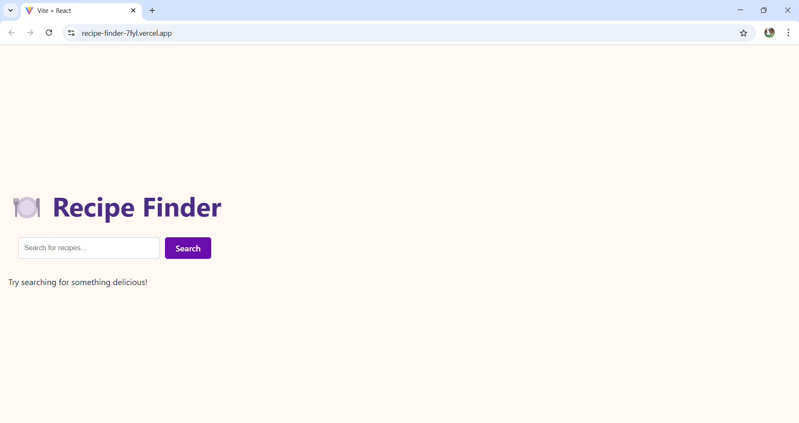
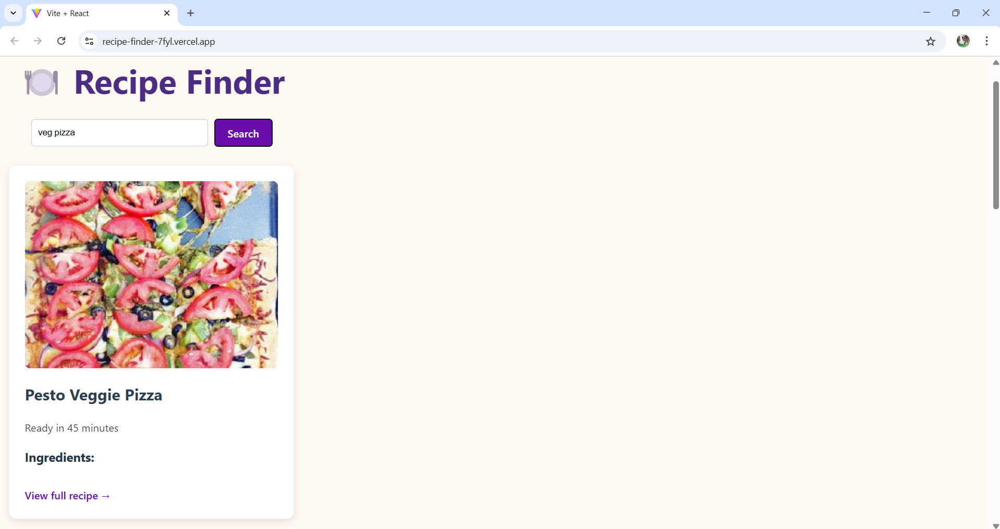

# 🍽️ Recipe Finder

A simple and attractive React app to search for recipes using the Spoonacular API. Users can enter any ingredient or dish name and get a list of recipes with images, ingredients, and preparation time.

---

## 🔧 Features

- Search recipes in real-time using Spoonacular API
- View recipe images, cooking time, and ingredients
- Link to full cooking instructions
- Clean, responsive UI using React + Vite

---

## 🚀 Screenshot & Video

▶️ [Watch Demo Video](working.mp4)

---

## 🛠️ Built With
React

Vite

Spoonacular API

---

## 📦 Deployment

https://recipe-finder-7fyl.vercel.app/
